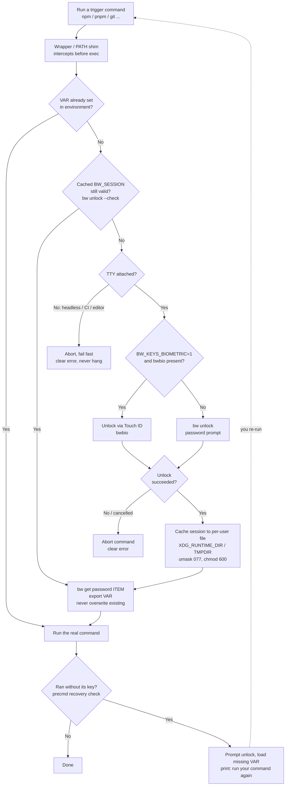

# zsh-bw-keys

Lazy Bitwarden secret injection for zsh — automatically loads secrets from your Bitwarden vault into environment variables the moment a specified command needs them.

## Requirements

- [Bitwarden CLI](https://bitwarden.com/help/cli/) (`brew install bitwarden-cli`)
- Logged in: `bw login`

## Installation

**Homebrew (recommended on macOS):**
```zsh
brew install RensHoogendam/tap/zsh-bw-keys
# then add to ~/.zshrc:
echo 'source "$(brew --prefix)/share/zsh-bw-keys/zsh-bw-keys.plugin.zsh"' >> ~/.zshrc
```
Brew also pulls in the `bitwarden-cli` dependency for you.

**Manual:**
```zsh
git clone https://github.com/RensHoogendam/zsh-bw-keys ~/.zsh/zsh-bw-keys
echo 'source ~/.zsh/zsh-bw-keys/zsh-bw-keys.plugin.zsh' >> ~/.zshrc
```

**Oh My Zsh:**
```zsh
git clone https://github.com/RensHoogendam/zsh-bw-keys ${ZSH_CUSTOM:-~/.oh-my-zsh/custom}/plugins/zsh-bw-keys
# Add zsh-bw-keys to plugins in ~/.zshrc
```

**zinit:**
```zsh
zinit light RensHoogendam/zsh-bw-keys
```

## Usage

Register keys in your `~/.zshrc` after sourcing the plugin:

```zsh
# bw-key-register VAR_NAME bitwarden-item-name [trigger-commands...]
bw-key-register GITHUB_TOKEN github-pat npm pnpm bun yarn
bw-key-register AWS_SECRET_ACCESS_KEY aws-dev-secret aws terraform
bw-key-register SOME_API_KEY my-api-key  # no triggers = loads on any command
```

The first time one of the trigger commands runs, it unlocks your Bitwarden vault (prompts once), loads the variable, and caches the session for the rest of the session. On reboot the cache clears and it prompts again.

Trigger commands are wrapped in shell functions, so the key is loaded right before the command actually runs — including in compound commands (`cd x && npm i`). If unlocking fails or is cancelled, the command is aborted with a clear error instead of crashing on the missing variable (e.g. npm's `Failed to replace env in config`).

### PATH shims — catching `command npm`, scripts, and aliases

Function wrappers are bypassed by `command npm`, by scripts, and by your own helper functions that call `command npm "$@"` internally. For those cases the plugin also generates real executable shims in `~/.cache/zsh-bw-keys/bin` (kept first in `$PATH`). A shim loads the key — prompting for unlock if needed — and then execs the real binary, so *any* invocation of a trigger command gets its key, no matter how it was reached.

Shims only prompt for unlock when a terminal is attached. In background contexts (editor tasks, CI, cron) a locked vault makes the command fail fast with a clear error instead of hanging on a password read or popping a surprise Touch ID dialog.

### Recovery after a failed command

If a command still manages to run without its key (cancelled unlock, wrapper bypassed, stale session), the plugin notices right after it finishes: it prompts you to unlock, loads the missing key, and prints:

```
⚠ Command needed GITHUB_TOKEN but it was not loaded — unlocking now...
✓ GITHUB_TOKEN loaded
↻ Keys loaded — run your command again.
```

The failed command is not re-run automatically — just run it again.

### When a load fails

If `bw` can't return a secret, the plugin reports *why* instead of blaming the item. It inspects `bw`'s own error and distinguishes:

- **Can't reach the server** — a network or `bw`/Node runtime error (DNS, TLS, resets, or a crash such as `ERR_STREAM_PREMATURE_CLOSE` from a Node/node-fetch gzip incompatibility). The item is fine; the round-trip is broken. Try `bw sync`, check the server, or pin `bw` to a working runtime via [`BW_KEYS_BW`](#pinning-the-bw-runtime-bw_keys_bw).
- **Locked / logged out** — run `bw-keys-clear`, then retry to re-unlock.
- **Item not found / ambiguous** — the item was renamed, deleted, not synced, or matches more than one entry.

The last line (`↳ …`) echoes `bw`'s own first error line for context. Secrets are never printed — they arrive on stdout, while only stderr is shown.

### Clearing the session cache

```zsh
bw-keys-clear
```

Removes the cached session file, unsets `BW_SESSION`, and unsets all registered variables in the current shell — forcing a fresh unlock and reload on the next trigger.

## Biometric unlock (optional, off by default)

Instead of typing your master password, you can unlock with Touch ID / Windows Hello via [bitwarden-cli-bio](https://github.com/jeanregisser/bitwarden-cli-bio) (`bwbio`), which talks to the Bitwarden desktop app:

1. Install: `brew install jeanregisser/tap/bitwarden-cli-bio` (needs Node ≥ 22)
2. In the Bitwarden **desktop app**: enable *Unlock with biometrics* and *Allow browser integration* (Settings → Security). Optionally enable *Ask to verify browser integration* for extra safety.
3. Opt in, in your `~/.zshrc`:

```zsh
export BW_KEYS_BIOMETRIC=1
```

If `BW_KEYS_BIOMETRIC` is unset (or `bwbio` is missing), the plugin uses the regular `bw unlock` password prompt. When biometrics fail or are unavailable, `bwbio` itself falls back to a password prompt.

## Pinning the bw runtime (`BW_KEYS_BW`)

By default the plugin calls the `bw` on your `$PATH`. `BW_KEYS_BW` overrides that invocation — the value is word-split, so you can run the CLI under a specific runtime or wrapper:

```zsh
# Run bw under a known-good Node when the current one crashes on gzip responses
export BW_KEYS_BW="$HOME/.volta/tools/image/node/22.20.0/bin/node $(command -v bw)"
```

This is the escape hatch for a broken `bw`/Node combination — e.g. a Homebrew upgrade that pairs a `bw` build with a Node version whose stream handling makes the bundled `node-fetch` abort gzipped responses (`ERR_STREAM_PREMATURE_CLOSE`). Pinning `bw` to a Node that works keeps secrets loading without downgrading your system Node (which other tools share). It applies to every `bw` call the plugin makes — session checks, unlocking, and reads. Leave it unset to use plain `bw`.

## Session security (optional)

By default an unlock is cached in per-user, ephemeral storage (`0600`, see [How it works](#how-it-works)) and stays valid until you `bw lock`, log out, or reboot. Two env vars let you tighten that — set either in `~/.zshrc`:

| Variable | Default | Effect |
|----------|---------|--------|
| `BW_KEYS_SESSION_TTL` | `0` (no expiry) | Seconds an unlock stays valid. Once it lapses, the next trigger re-authenticates. Bounds the window in which a leaked session is usable, and adds the idle-lock the `bw` CLI itself lacks. |
| `BW_KEYS_NO_DISK_CACHE` | unset | When `1`, the session is never written to disk — it lives only in the current shell. Maximum isolation, but every new terminal re-unlocks (no cross-terminal sharing). |

```zsh
export BW_KEYS_SESSION_TTL=900    # re-auth 15 min after each unlock
export BW_KEYS_NO_DISK_CACHE=1    # optional: memory-only, no shared session file
```

A `BW_SESSION` unlocks your **entire** vault, so the cached key is high-value. The TTL pairs naturally with [biometric unlock](#biometric-unlock-optional-off-by-default): with Touch ID the re-auth is a ~1s tap, so a short TTL costs almost nothing. For more isolation, point the plugin's items at a dedicated dev vault so a leaked session can't reach personal logins.

> **Scope of TTL expiry:** the TTL revokes the session in the current shell and removes the shared cache file. It cannot reach back into child processes (subshells, backgrounded jobs) that already inherited `BW_SESSION` in their environment at unlock time — those keep their copy for their own lifetime. This is inherent to how Unix exports environment variables, not specific to this plugin. Likewise, secrets are passed to `bw` via the exported `BW_SESSION` env var rather than a `--session` argument, so they don't show up in `ps`/`/proc/<pid>/cmdline`.

## How it works

- Session is cached in per-user, ephemeral storage — `$XDG_RUNTIME_DIR` (Linux) or `$TMPDIR` (macOS `/var/folders`), never world-readable `/tmp`; the file is `chmod 600` and cleared on logout/reboot
- Cached sessions are validated before use — after `bw lock` or logout the plugin re-prompts instead of failing
- Already-set variables are never overwritten
- If no trigger commands are specified, the key loads before any command
- Optionally time-bounded (`BW_KEYS_SESSION_TTL`) or kept memory-only (`BW_KEYS_NO_DISK_CACHE`) — see [Session security](#session-security-optional)

### Flow



Editable source: [`docs/secret-flow.drawio`](docs/secret-flow.drawio) — open in [draw.io](https://app.diagrams.net).

## Development

```zsh
zsh -n zsh-bw-keys.plugin.zsh   # parse-lint
zsh test/run.zsh                # test suite (no deps; mocks bw)
```

[CI](.github/workflows/ci.yml) runs both on Linux and macOS for every push and PR.

## Releasing (maintainers)

Cutting a release is just a tag — CI does the rest:

```zsh
git tag v1.1.0
git push origin v1.1.0
```

The [`Release`](.github/workflows/release.yml) workflow then **lint+tests the plugin, and only if green** recomputes the release tarball's `sha256` and updates the formula in [`RensHoogendam/homebrew-tap`](https://github.com/RensHoogendam/homebrew-tap), so `brew upgrade zsh-bw-keys` picks it up within ~20s. (Also create a GitHub Release for the tag if you want published notes.)

**One-time setup:** the workflow needs a `HOMEBREW_TAP_TOKEN` repo secret — a fine-grained PAT scoped to **only** the `homebrew-tap` repo with **Contents: write** (the built-in `GITHUB_TOKEN` can't push to another repo). Without it the job skips cleanly.
